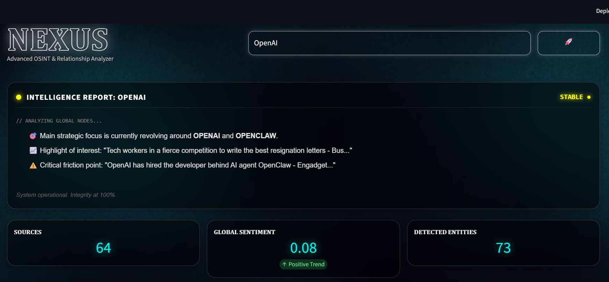
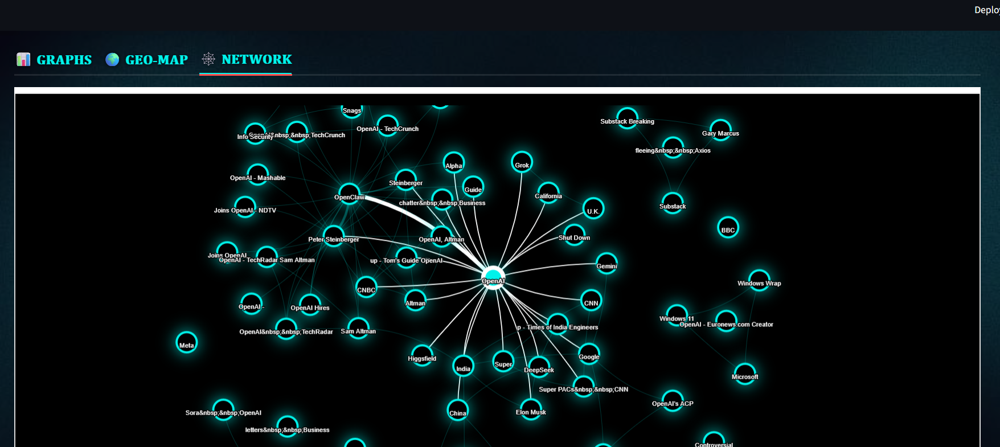
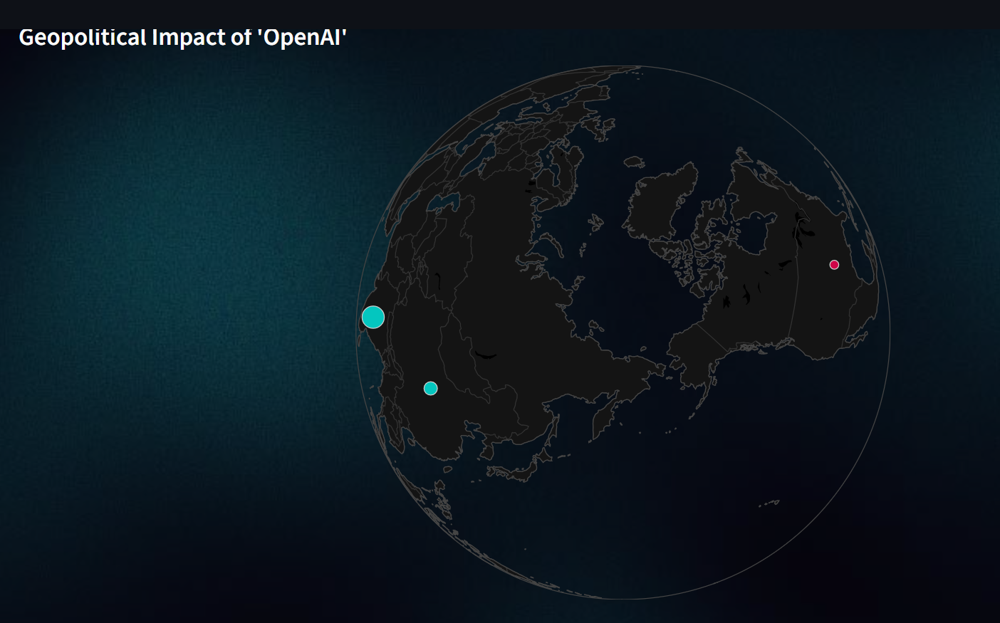
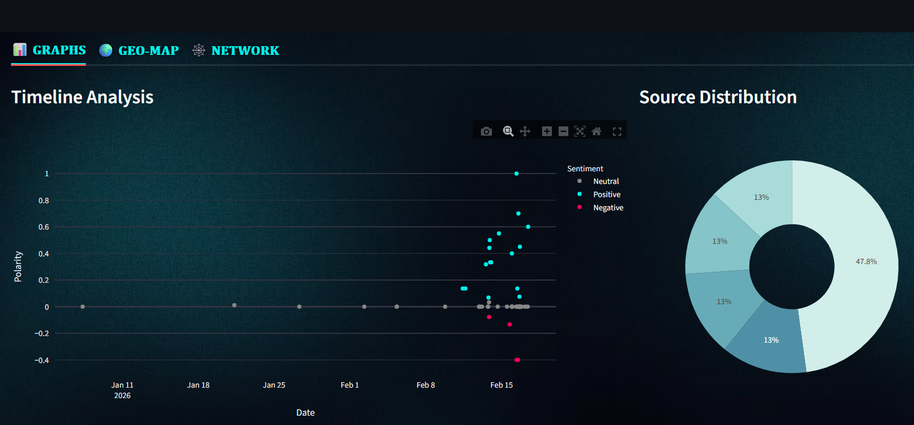

## 🌐 NEXUS
AI-Powered OSINT & Intelligence Analysis Platform
"Transform global news into actionable intelligence."

## 📌 Overview

NEXUS is an AI-powered Open Source Intelligence (OSINT) platform designed to detect hidden relationships, sentiment shifts, and geopolitical impact zones from real-time global news feeds.
By combining Natural Language Processing (NLP), network analysis, and 3D geospatial visualization, Nexus converts raw news data into interactive intelligence dashboards.

It is built for:
Researchers
Analysts
Cybersecurity enthusiasts
Intelligence simulation projects
AI experimentation

🚀 Core Capabilities
📰 Real-Time Intelligence Collection

Aggregates live news feeds using feedparser
Continuously processes incoming data streams

## 🧠 AI-Driven NLP Analysis

Sentiment Analysis:
Uses TextBlob to classify polarity (Positive / Neutral / Negative)

Named Entity Recognition (NER):
Identifies:

People
Organizations
Geopolitical entities
Powered by spaCy (en_core_web_sm)

## 🕸️ Relationship Network Mapping

Builds entity relationship graphs using NetworkX
Interactive visualization with PyVis

Detects:

Entity clusters
Connection density
Influence hubs

## 🌍 3D Geopolitical Visualization

Maps sentiment intensity onto an interactive 3D globe
Visualizes regional impact zones
Built using Plotly + Streamlit components

## ⚡ Automated Intelligence Briefings

Generates concise bullet-point summaries

Highlights:

Rising tensions
Strategic regions
High-frequency actors
Sentiment spikes

## 🛠️ Technology Stack
Layer	Technologies
Core	Python 3.x
UI	Streamlit (Custom Cyberpunk Styling)
NLP	spaCy, TextBlob
Graph Analysis	NetworkX
Visualization	Plotly Express, PyVis
Data Processing	Pandas, Feedparser

## 📸 Screenshots

Nexus in action analyzing global data nodes for **OpenAI**:

| Intelligence Dashboard | Network Relationship Mapping |
|---|---|
|  |  |
| **Geopolitical Impact Map** | **Timeline & Sentiment Analysis** |
|  |  |

## 💻 Installation Guide
1️⃣ Clone the Repository
git clone https://github.com/DenizKaraman461/nexus-osint.git
cd nexus-osint

2️⃣ Install Dependencies
pip install -r requirements.txt

3️⃣ Download NLP Model
python -m spacy download en_core_web_sm

4️⃣ Launch the Application
streamlit run app.py

## 🧪 Recommended Environment

Python 3.10+

Virtual environment recommended

Minimum 8GB RAM (for smoother NLP processing)

## ⚠️ Disclaimer

This tool is developed strictly for educational and research purposes.

It aggregates publicly available news data.

All analysis is algorithmic.

The developer assumes no responsibility for decisions made based on this system.

## 📜 License

Licensed under the MIT License.
See LICENSE file for details.

## 👨‍💻 Developer

Deniz Karaman
GitHub: DenizKaraman461